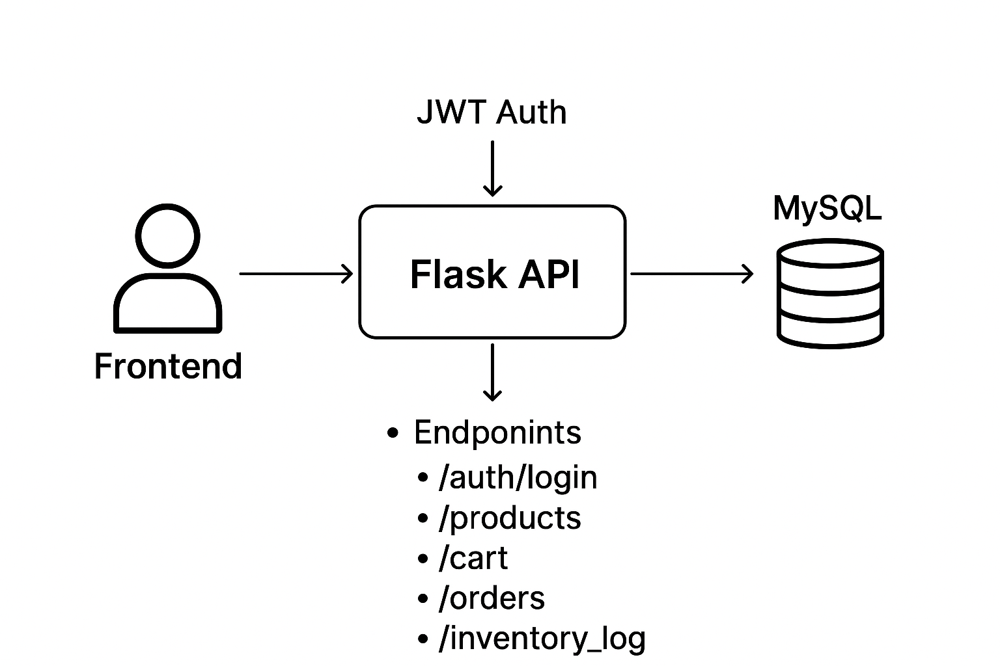

# LibroTrack — README

## Project Overview

**LibroTrack** is a full-stack web application featuring:

* **Backend:** Flask with JWT authentication and MySQL database
* **Frontend:** Angular

---

## Prerequisites (Windows)

* **Python 3.9+**
* **Node.js & npm**
* **Angular CLI (optional globally):**

```bash
npm i -g @angular/cli
```

* **MySQL Server**

---

## Environment Variables

Create a `.env` file or set environment variables:

```
FLASK_APP=app.py
FLASK_ENV=development
DB_HOST=localhost
DB_USER=root
DB_PASS=
DB_NAME=librotrackdb
JWT_SECRET_KEY=your_jwt_secret
```

**Windows PowerShell example:**

```powershell
$env:FLASK_APP="app.py"
$env:FLASK_ENV="development"
$env:JWT_SECRET_KEY="your_jwt_secret"
```

---

## Backend (Flask) Setup

1. **Create and activate virtual environment**:

```bash
python -m venv venv
# Activate PowerShell
venv\Scripts\Activate.ps1
# or CMD
venv\Scripts\activate.bat
```

2. **Install dependencies**:

```bash
pip install -r requirements.txt
```

3. **Enable CORS (example in `app.py`)**:

```python
from flask_cors import CORS

CORS(app, resources={r"/*": {"origins": ["http://localhost:4200", "http://localhost:5000"]}}, supports_credentials=True)
```

4. **Run Flask app**:

```bash
flask run
```

---

### Database Setup

* Ensure MySQL server is running.
* Configure your database settings in `config.py`.
* Create required tables (`Users`, `Products`, `Cart`, `Orders`, etc.) using migrations or SQL schema.

---

### Register Blueprints

Example in `app.py`:

```python
from products import products_bp
app.register_blueprint(products_bp, url_prefix="/products")
```

---

## Frontend (Angular) Setup

1. Navigate to the `front_end` folder:

```bash
npm install
```

2. Run the Angular development server:

```bash
ng serve --open
# or if Angular CLI not global
npx ng serve --open
```

3. **Standalone components**: Ensure they import `CommonModule` for pipes (currency, etc.):

```ts
imports: [CommonModule]
```

---

## Endpoints Checklist (Quick Test)

**1. Health Check**

```bash
curl -i http://localhost:5000/
```

Expected: `200 OK` JSON response.

**2. Auth — Login**

```bash
curl -i -X POST http://localhost:5000/auth/login \
-H "Content-Type: application/json" \
-d '{"email":"a@b.com","password":"pass"}'
```

**3. Auth — Register**
(if endpoint exists)

**4. Profile (Protected)**

```bash
curl -i http://localhost:5000/profile \
-H "Authorization: Bearer <TOKEN>"
```

**5. Products**

| Action  | Method | Endpoint                                 |
| ------- | ------ | ---------------------------------------- |
| GET all | GET    | `/products`                              |
| GET one | GET    | `/products/{id}`                         |
| CREATE  | POST   | `/products` (Bearer token required)      |
| UPDATE  | PUT    | `/products/{id}` (Bearer token required) |
| DELETE  | DELETE | `/products/{id}` (Bearer token required) |

Example GET:

```bash
curl -i http://localhost:5000/products
```

---

## Common Issues & Fixes

1. **Angular build errors**: `"must have required property 'buildTarget'"`

   * Ensure `angular.json` uses `browserTarget`.
   * Or update Angular CLI:

   ```bash
   npm i -g @angular/cli@latest
   ```

2. **CORS Issues**:

```python
CORS(app, resources={r"/*": {"origins": ["http://localhost:4200", "http://localhost:5000"]}}, supports_credentials=True)
```

3. **Currency pipe errors**: `"No pipe found with name 'currency'"`

   * Import `CommonModule` in standalone components or module.
   * Do **not** add `CurrencyPipe` to providers; only inject programmatically if needed.

4. **Angular Forms/ngModel errors**:

   * Ensure `FormsModule` is imported in module or standalone component imports.

---

## Testing

* **Backend:** Use `pytest` or `unittest` to test endpoints, or run the curl checklist.
* **Frontend:**

```bash
ng test
```

---

## Deployment

1. **Build Angular**:

```bash
ng build --configuration production
```

Copy `dist/<project-name>` to web server or serve with Flask static route.

2. **Reverse proxy / hosting**:

   * Configure nginx or Apache for static files
   * Or use `send_from_directory` in Flask.

---

## Troubleshooting

1. Check console/server logs for errors.
2. Verify environment variables & database connectivity.
3. Reinstall dependencies if issues arise:

```bash
# Angular
rm -r node_modules
npm install

# Python
pip install -r requirements.txt
```

---

## Useful Commands

| Command               | Purpose                      |
| --------------------- | ---------------------------- |
| `npx ng serve --open` | Run Angular frontend         |
| `flask run`           | Run Flask backend            |
| `npx ng build`        | Build Angular for production |

---

## Contact

For issues: Open an issue in the repository including:

* Failing endpoint & request details
* Full backend response & logs
* Frontend console errors

---

## Project Architecture

### 1. Backend (Flask)

**Structure & Blueprints:**

```
app.py                 # Main Flask app, JWT, CORS, blueprint registration
routes/
│
├─ auth_routes.py      # Login, JWT token creation
├─ user_routes.py      # User registration
├─ profile_routes.py   # Profile retrieval & editing
├─ cart.py             # Cart management, checkout
├─ products.py         # CRUD for products, filters, search
├─ orders.py           # Orders CRUD
├─ order_details.py    # Order details CRUD
└─ inventory_log.py    # Inventory logging and CRUD
database/
└─ connection.py       # get_db() helper for MySQL connection
utils/
└─ hash.py             # Password hashing and verification
config.py              # App configuration (DB, JWT secret, etc.)
uploads/               # User uploaded images
```

**Backend Flow Example (User Login → Access Products → Checkout):**

1. **User login** (`/auth/login`) → JWT token
2. **Fetch products** (`/products`)
3. **Add to cart** (`/cart/add`)
4. **Checkout** (`/cart/checkout`) → Creates `orders` and `order_details` records
5. **Inventory log** automatically updated (`inventory_log` table)

---

### 2. Frontend (Angular)

**Structure Overview:**

```
front_end/
│
├─ src/
│  ├─ app/
│  │  ├─ components/      # UI components (products, cart, profile)
│  │  ├─ services/        # HTTP services for API calls
│  │  ├─ guards/          # Auth guards
│  │  ├─ app.module.ts    # Module & imports
│  │  └─ app-routing.module.ts  # Routing
│  └─ assets/             # Images, icons, CSS
├─ angular.json
└─ package.json
```

**Frontend Flow Example:**

1. User logs in → JWT stored in local storage
2. Components call services → Attach JWT in `Authorization` header
3. Display products, cart, and orders dynamically
4. Admin actions (add/update products) update backend & inventory log

---

### 3. Database Schema (MySQL)

**Tables Overview:**

| Table           | Description                                                                      |
| --------------- | -------------------------------------------------------------------------------- |
| `Users`         | Stores user accounts (id, name, email, password, role, contact, address, image)  |
| `Products`      | Product catalog (id, name, category, description, price, stock, image)           |
| `Cart`          | User cart items (id, user_id, product_id, quantity)                              |
| `Orders`        | User orders (id, user_id, order_date, total_amount, status)                      |
| `Order_Details` | Products per order (id, order_id, product_id, quantity, subtotal)                |
| `Inventory_Log` | Tracks product inventory changes (id, product_id, date, type, quantity, remarks) |

**Relationships:**

* `Users` 1 → N `Orders`
* `Orders` 1 → N `Order_Details`
* `Products` 1 → N `Order_Details`
* `Products` 1 → N `Inventory_Log`

---

### 4. Data Flow Diagram (Simplified)

```
[Frontend Angular] 
       |
       v
  [Flask API] -- JWT Auth --> [Database MySQL]
       |
       v
   Endpoints:
   - /auth/login
   - /products
   - /cart
   - /orders
   - /inventory_log
```

* All CRUD operations (Products, Orders, Cart, Inventory) pass through Flask API.
* Inventory updates automatically logged in `inventory_log`.
* JWT token secures protected endpoints.




